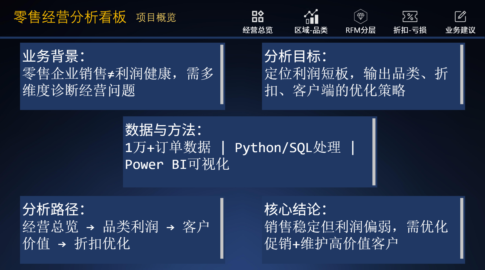
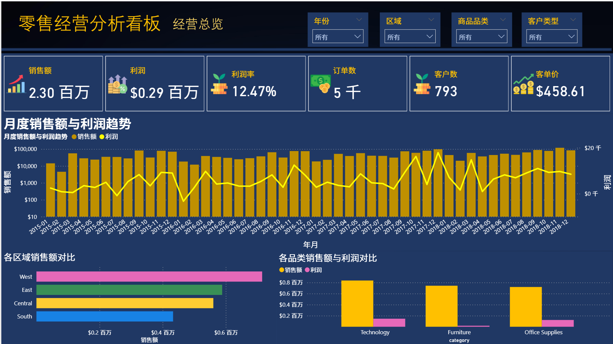
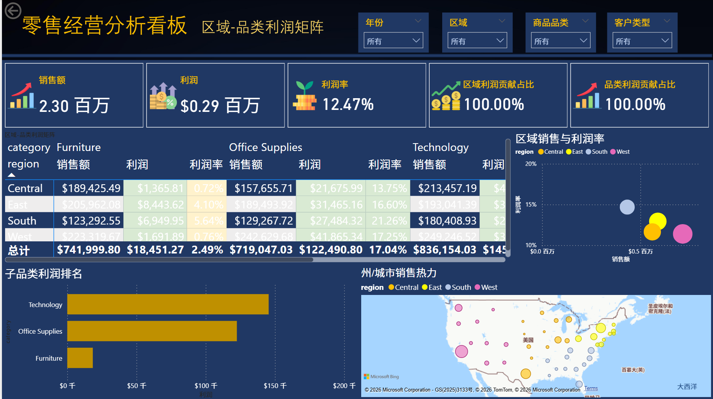
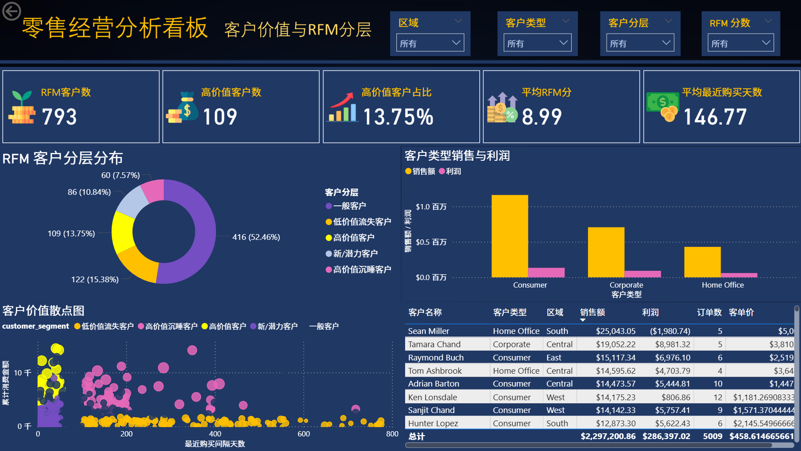
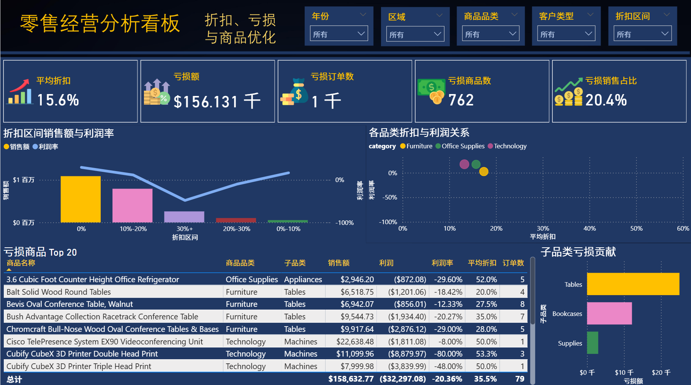
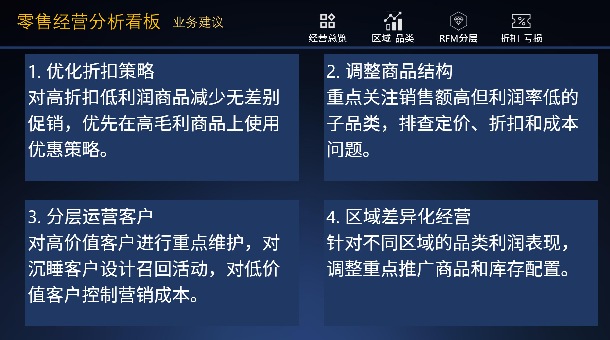

# 零售用户与销售经营分析看板

## 项目背景
零售企业销售额增长不一定代表利润健康，因此需要从销售额、利润率、折扣、品类和客户价值多个角度诊断经营问题。

## 分析目标
- 搭建销售经营总览看板
- 识别区域和品类利润短板
- 分析客户价值分层
- 评估折扣对利润的影响
- 输出经营优化建议

## 数据说明
基于 Sample Superstore 零售订单数据，清洗后约 1 万条订单明细，包含订单、客户、商品、区域、销售额、利润、折扣等字段。

## 技术栈
SQL、Python、Pandas、Power BI、DAX、RFM 客户分层

## 看板页面与效果预览
1.  项目概览

2.  经营总览

3.  区域-品类利润矩阵

4.  客户价值与 RFM 分层

5.  折扣、亏损与商品优化

6.  业务建议

## 核心发现
- 整体销售额约 230 万，利润约 28.6 万，利润率约 12.47%
- 不同区域和品类利润表现差异明显
- 部分高折扣商品存在利润侵蚀问题
- 客户价值分层差异明显，高价值客户应重点维护
